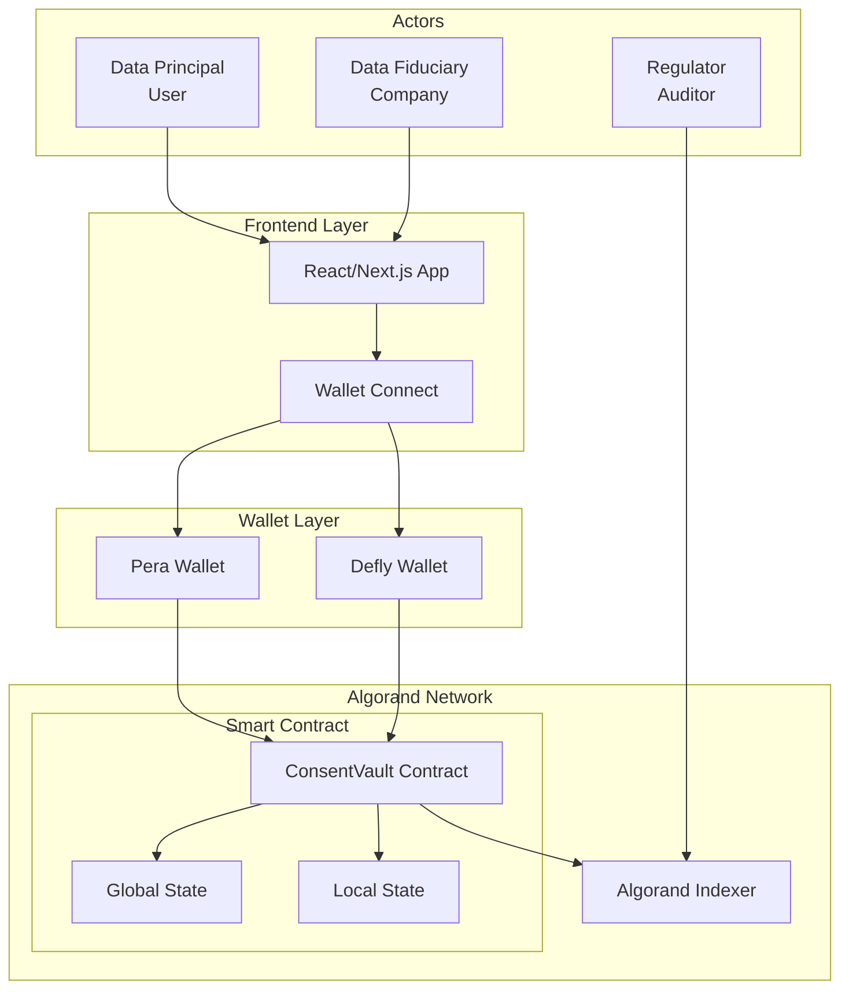
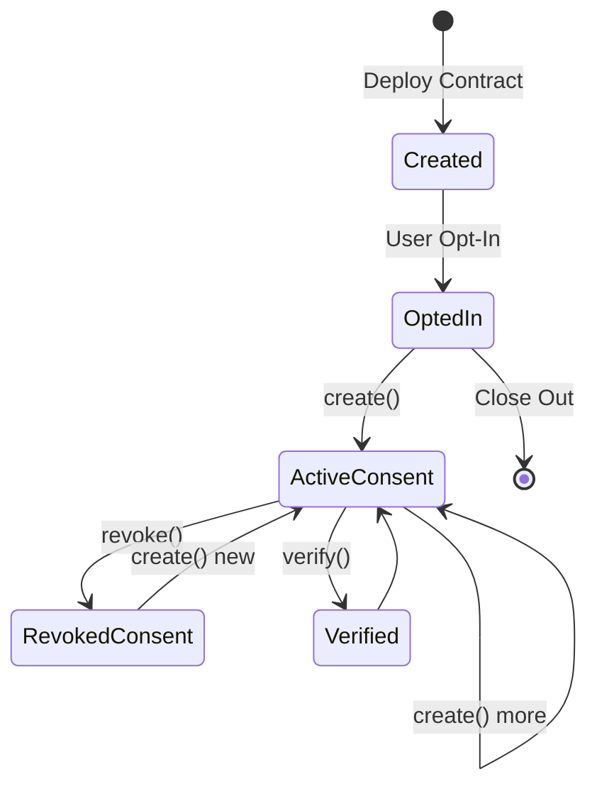
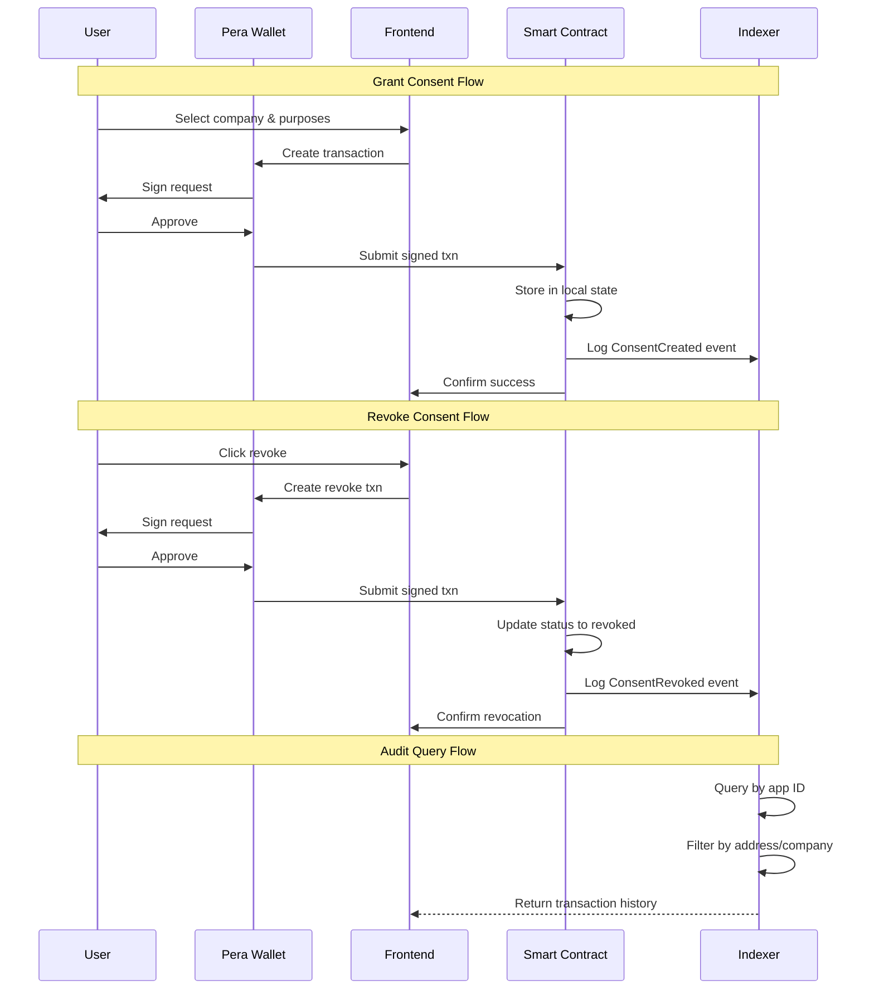
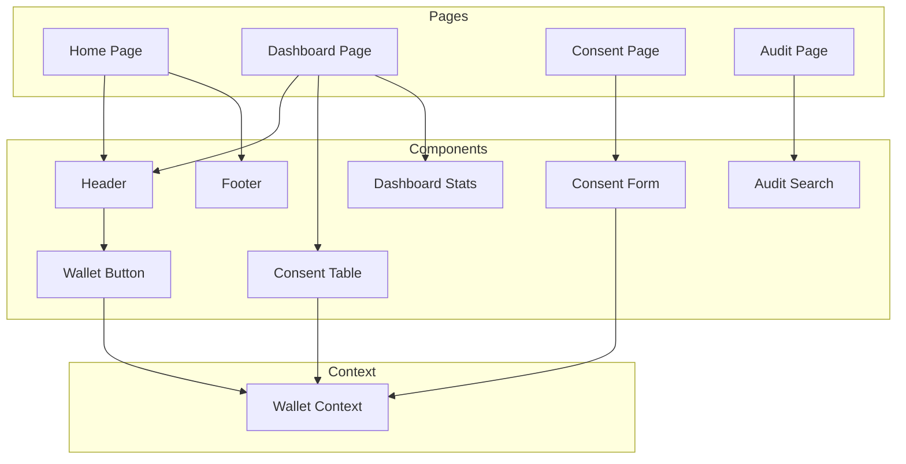
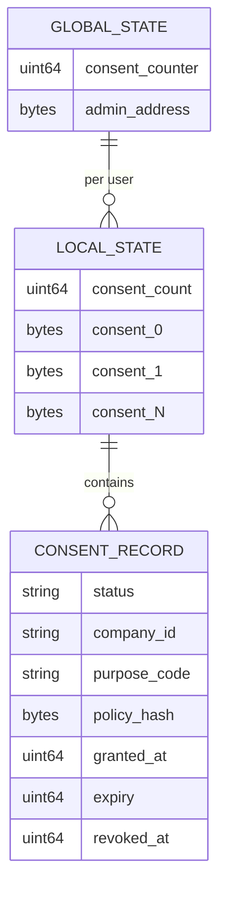
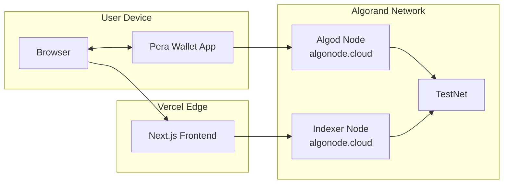
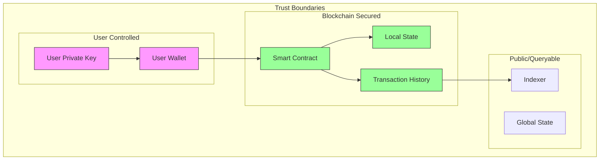
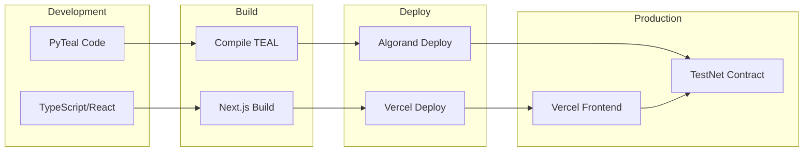

# ConsentVault Architecture

## System Overview

## Smart Contract Architecture

## Data Flow

## Component Breakdown

### Frontend Components

### Smart Contract State

## Network Architecture

## Security Model

## Deployment Pipeline

## Technology Stack

| Layer | Technology | Purpose |
|-------|------------|---------|
| Frontend | Next.js 16 | Server-side rendering, routing |
| Styling | Tailwind CSS 4 | Utility-first CSS |
| Components | shadcn/ui | Accessible UI components |
| Wallet | Pera Wallet | Algorand wallet connection |
| Smart Contract | PyTeal | Python to TEAL compilation |
| Blockchain | Algorand | Layer-1 blockchain |
| Indexer | Algorand Indexer | Historical query API |
| Hosting | Vercel | Frontend deployment |
